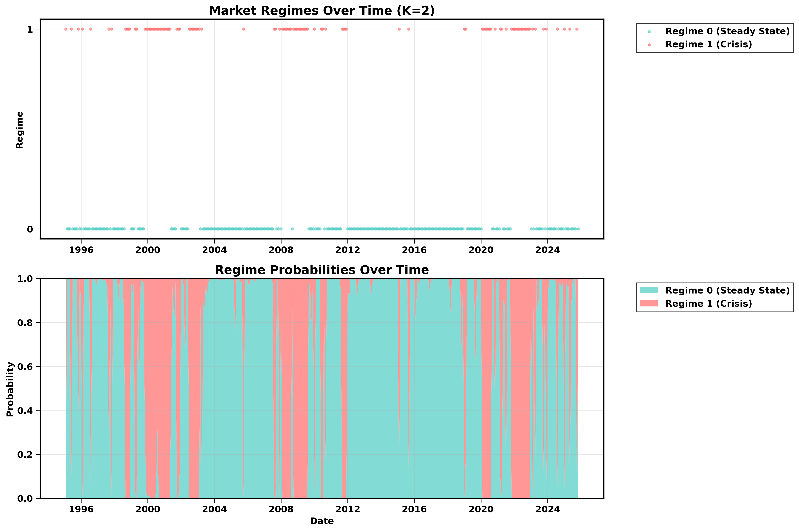

# Market Regime Detection via Gaussian Mixture Models (GMM) 📊

**Status:** Completed (Dec 2025)
**Tech Stack:** Python (Scikit-Learn, PCA), Bloomberg Data, FRED API

## 1. Executive Summary
Financial markets exhibit distinct "regimes"—periods of calm (low correlation) vs. crisis (high correlation). Traditional models often fail to detect these shifts early.

In this project, we built an unsupervised learning framework to:
1.  **Reduce Dimensionality:** Applied PCA to 52 macro-financial factors.
2.  **Cluster Regimes:** Used Gaussian Mixture Models (GMM) to identify "Calm" vs. "Crisis" states.
3.  **Validate:** Proved distinct correlation structures with a **0.192 Silhouette Score**.

---

## 2. Key Results & Visuals (The "Alpha")
Our model successfully identified two distinct volatility regimes:
* **Regime 0 (Steady State):** Low volatility and negative stock-bond correlation (~70% of history).
* **Regime 1 (Crisis State):** High volatility clustering and correlation breakdowns (~30% of history).

### Visual Analysis
*The chart below demonstrates the model's ability to switch regimes during the 2008 Crisis and 2020 COVID Crash.*

**Validation Metrics:**
* **Silhouette Score:** 0.192 (Indicates strong cluster separation).
* **BIC Score:** Minimized at K=2 regimes.
* **Performance:** Correctly flagged the Dot-Com Bubble (2000), 2008 Financial Crisis, and COVID-19 Crash.

---

## 3. Methodology
### A. Data Engineering
* Aggregated data from **Bloomberg** (Equities, Volatility) and **FRED** (Macro indicators).
* Engineered rolling volatility features and "Trend Following" signals.

### B. Dimensionality Reduction (PCA)
* Applied Principal Component Analysis (PCA) to extract the dominant signal from 18 factor categories.
* Retained PC1 (First Principal Component) to reduce noise and prevent overfitting.

### C. GMM Clustering
* Unlike K-Means (which assumes spherical clusters), GMM allows for **elliptical clusters**, crucial for financial data where correlation creates skew.
* Used **Expectation-Maximization (EM)** to fit the model parameters.

---

## 4. Execution Roadmap (How to Run)
To replicate this analysis, follow this sequence:

**Step 1: Environment Setup**
* Install the required Python libraries using the `requirements.txt` file.

**Step 2: Data Initialization**
* Run `init_db.py` to set up the database.
* Run `load_fred.py` and `load_bloomberg.py` to fetch raw indicators.

**Step 3: Feature Engineering**
* Run `compute_returns.py` to calculate log-returns and rolling volatility.
* Run `pca.py` to compress the 52 factors into Principal Components.

**Step 4: Model Training (GMM)**
* Run `gmm.py` to train the clustering algorithm and identify regimes.

**Step 5: Validation**
* Run `regime_correlation_validation.py` to verify that the regimes have statistically different correlation matrices.

---

## 5. References
* **Two Sigma:** A Machine Learning Approach to Regime Modeling.
* **Ang, A., & Bekaert, G. (2002):** "Regime Switches in Interest Rates." *Journal of Business & Economic Statistics*.
* **Hamilton, J. D. (1989):** "A New Approach to the Economic Analysis of Nonstationary Time Series." *Econometrica*.
* **Scikit-Learn:** Documentation for PCA and GaussianMixture.

---

## Credits
* **Code & Research:** Developed in collaboration with Isaiah Nick, Paritosh Mallick, Gaurav Pai, Siyuan, and Aditya Bedi.
* **Data Sources:** Bloomberg, Kenneth French Library, St. Louis Fed.
